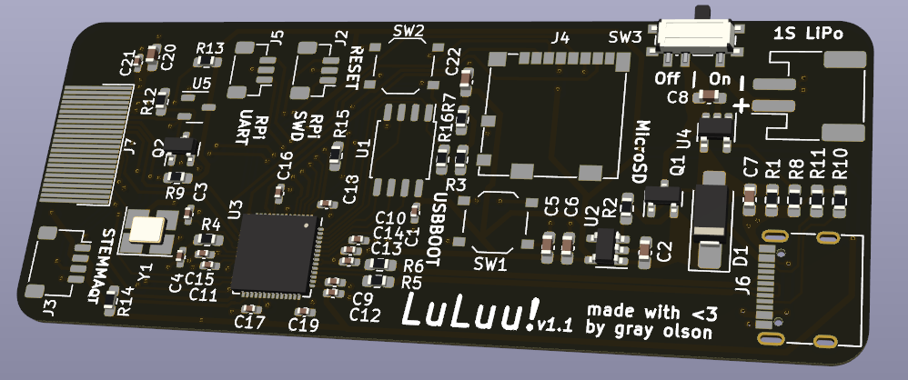

# LuLuu!

A cute and smart arm-warmer sleeve with a 1.3" full color TFT display built into the back of the
hand ^_^

## Hardware

Runs on a RaspberryPi RP2040 microcontroller. The small 30x75mm PCB has built-in battery management for a single-cell
LiPo, microSD card storage, and direct connection via SPI to an Adafruit 4520 1.3" TFT (ST7789VW controller). It's
also designed to be expanded via SparkFun Qwiic/Adafruit STEMMA QT compatible (3.3v only) I2C sensor modules. Finallly,
it implements the RaspberryPi 3-wire debug connector spec for ARM SWD serial-wire debugging and RS232-style
UART communication.

The hardware design files all live in the [`hardware/`](hardware/) folder. See the [`README`](hardware/README.md) in
that folder for more.

## Software

The firmware that the LuLuu runs is contained in the [`software/`](software/) folder.
It is written in Rust using some of the amazing Rust embedded tooling.
See the [`README`](software/README.md) in that folder for more.

### Installing

You can either install the firmware using the pre-built binary firmware or you can
build it yourself.

#### Pre-built firmware

You can install a pre-built firmware easily via USB by connecting the LuLuu PCB to
your computer via USB, holding the `USBBOOT` button and then pressing the `RESET`
button. This will put the LuLuu into "USB Bootloader mode," causing a "USB storage" 
device to appear on your computer, into which you can drop the compiled `luluu.uf2`
(TODO: link built firmware).

#### Building yourself

To build yourself, see the [`README`](software/README.md) in the
[`software/`](software/) folder.

## Licenses

Hardware is provided under the CERN Open Hardware License 2.0 Permissive variant.

Software is provided under MIT or Apache-2.0 at your choice.

License texts available in the [`licences/`](licenses/) folder.

